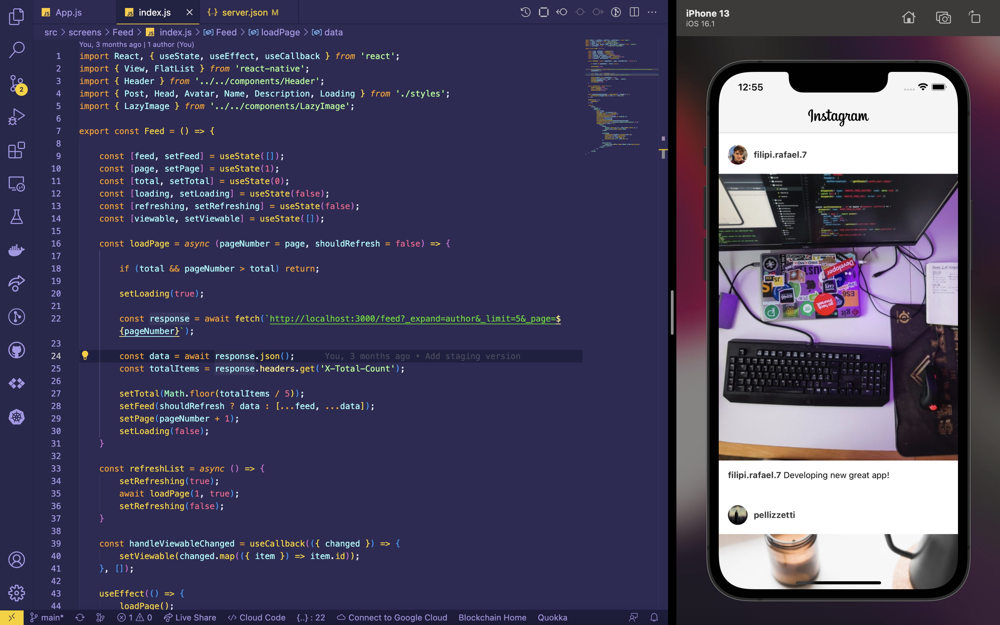

## 🚀 Sobre o Projeto
A ideia do projeto foi para aplicar, práticar e melhorar minhas habilidades técnicas em desenvolvimento mobile com React Native e mais tecnologias que envolvendo a concepção, desenvolvimento e entrega do produto.

## 🚀 Novas versões
Conforme vou adquirindo novas habilidades, irei atualizando o projeto em novas versões.

## 🚀 Tecnologias utilizadas
- Javascript
- React Native
- Expo

## 🚀 Screenshots

<video src="./src/assets/video.mp4" type="video/mp4"></video>

# Insta Clone

| :placard: Vitrine.Dev |     |
| -------------  | --- |
| :sparkles: Nome        | **Insta Clone**
| :label: Tecnologias | Javascript, React Native, Expo (tecnologias utilizadas)
| :rocket: URL         | https://github.com/FilipiRafael/insta-clone-react-native
| :fire: Desafio     | https://github.com/FilipiRafael/insta-clone-react-native

<!-- Inserir imagem com a #vitrinedev ao final do link -->

## Detalhes do projeto

A ideia do projeto foi para aplicar, práticar e melhorar minhas habilidades técnicas em desenvolvimento mobile com React Native e mais tecnologias que envolvendo a concepção, desenvolvimento e entrega do produto.
